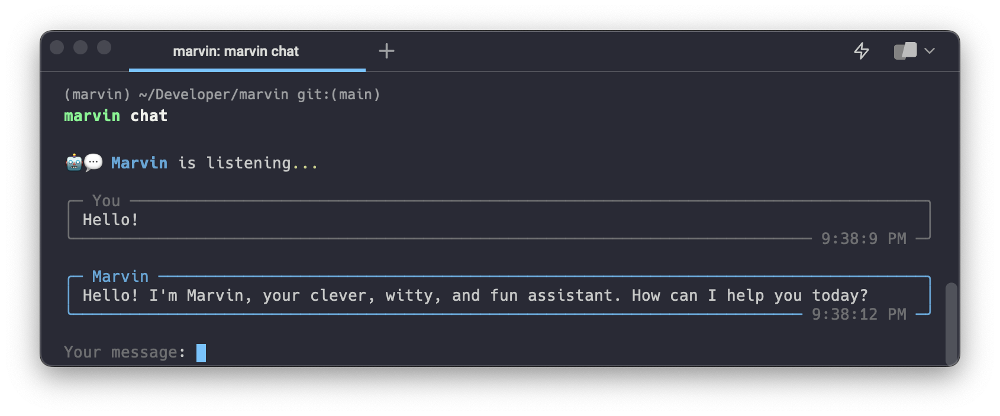

# Bots

One of Marvin's central abstractions is the `Bot` class. At its core, a bot is an interface for sending text to a LLM and receiving a response. Marvin allows users to customize this behavior in various ways that can transform bots from "AI assistants" to reusable programs.

## Python

### Interactive use
To create a bot, instantiate the bot class. 
```python
from marvin import Bot

ford_bot = Bot(
    name="Ford", 
    personality="Can't get the hang of Thursdays", 
    instructions="Always responds as if researching an article for the Hitchhiker's Guide to the Galaxy"
)
```

You can immediately talk to the bot by calling its `say()` method, which is an async coroutine.

```python
await ford_bot.say("Hello!")
```

A synchronous convenience method is also available: 
```python
ford_bot.say_sync("Hello again!")
``` 

### Saving bots

Bots can be saved to the database by calling the `Bot.save()` method. Bots are saved under the name they're given and **will overwrite** any existing bot with the same name.

```python
bot = Bot("Ford")
await bot.save()
```

### Loading bots

Bots can be loaded with the `Bot.load()` method.

```python
bot = await Bot.load("Ford")
```

## CLI

### Interactive use

To chat with a bot from the CLI, run `marvin chat` with optional name, personality, or instruction flags.



### Loading an existing bot

If you have saved a bot, you can load it in the CLI by using the `-b` flag and providing the bot's name:

```shell
marvin chat -b Arthur
```
## Customization 
### Name
Names are unique identifiers that make it easy to reference a specific bot.

### Instructions
Instructions define the bot's behavior by specifying how it should respond. For example, the default instructions are to assist the user. However, more utilitarian bots might be instructed to only respond with JSON (or with a specific JSON schema), extract keywords, always rhyme, etc. Bots, especially GPT-4 bots, should not go against their instructions at any time.

### Personality
Personality affects the style of the bot's responses, for example the tone, humor, how often the bot checks for confirmation, etc.

By combining personality and instructions, bot instances can produce complex behavior that can be very different from what users might expect from a chat interface.

### Plugins
Plugins allow bots to access new information and functionality. By default, bots have plugins that let them browse the internet, visit URLs, and run simple calculations.

### Formatting responses

You can optionally enforce certain formats for the bot's responses. In some cases, you can also validate and even parse the resulting output into native objects.

Please note: complex response formatting is significantly better with GPT-4 than GPT-3.5.

To set up formatting, you need to supply a `ResponseFormatter` object that defines formatting, validation, and parsing. As a convenience, Marvin also supports a "shorthand" way of defining formats that will let the library select the most appropriate `ResponseFormatter` automatically. Shorthand formats can include natural language descriptions, Python types, JSON instructions, or Pydantic models. 

Here are examples of various shorthand formats:

#### Python types

Supply Python types to have the bot enforce the appropriate return types. Python types are always validated and parsed.

```python
bot = Bot(response_format=bool)
response = await bot.say('Are these statements equivalent? 1: The coffee is hot. 2: The coffee is scalding.')

print(response.parsed_content) # True
```

```python
bot = Bot(response_format=list[dict[str, int]])
response = await bot.say("Format this: (x is 1, y is two), (a is 3, b is 4)")

print(response.parsed_content) # [{'x': 1, 'y': 2}, {'a': 3, 'b': 4}]
```

#### Natural language

You can describe the format you want the bot to use, and it will do its best to follow your instructions. If your description includes the word "json", then it will also be parsed and validated (you can enable this explicitly by providing a `JSONResponseFormatter`).

```python
bot = Bot(response_format="a JSON list of strings")
response = await bot.say("Which of these are capitalized: Apple, banana, cherry, Date, elephant")

print(response.parsed_content) # ["Apple", "Date"]
```

```python
bot = Bot(response_format="a hyphenated list")
response = await bot.say("Which of these are capitalized: Apple, banana, cherry, Date, elephant")

print(response.parsed_content) # '- Apple\n- Date'
```

```python
bot = Bot(response_format='<animal> like to eat <food> and live in <biome>')
response = await bot.say('tell me about foxes')

print(response.parsed_content) # "Foxes like to eat small mammals and live in forests."
```

#### Pydantic

```python
class MyFormat(BaseModel):
    x: int
    y: str = Field("The written form of x")

bot = Bot(response_format=MyFormat)
response = await bot.say("Generate output where x is 22")

print(response.parsed_content) # MyFormat(x=22, y='Twenty-two')
```
