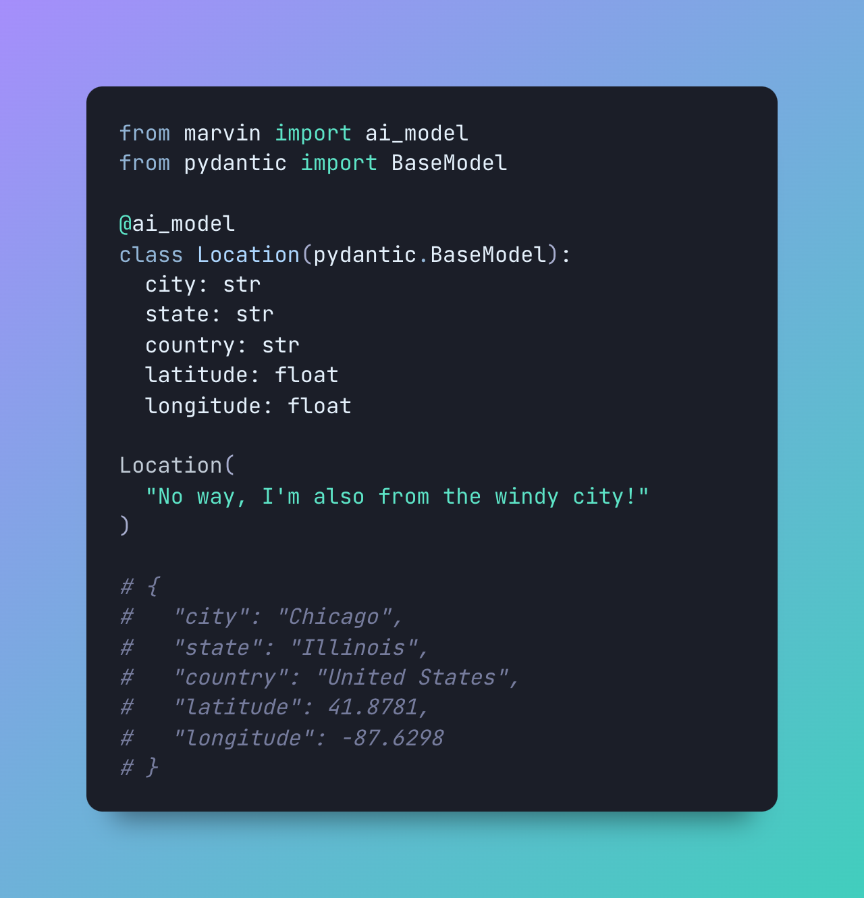

# 🪄 AI Functions



!!! tip "Features"

    🎉 Create AI models with a single @ai_model decorator

    🧱 Define Pydantic models that work with both structured data and unstructured text

    🔗 Use AI models to transform raw text into type-safe outputs

    🧙 Enhance your data schema with AI capabilities that would be difficult or impossible to implement manually


AI models are Pydantic models that are defined locally but use AI to process their inputs. Like normal Pydantic models, AI models define a schema that data must comply with. Unlike normal Pydantic models, they can handle unstructured text and automatically convert it into structured, type-safe outputs without requiring any additional source code!

Consider the following example, which contains a function that generates a list of fruits. The function is defined with a descriptive name, annotated input and return types, and a docstring -- but doesn't appear to actually do anything. Nonetheless, because of the `@ai_fn` decorator, it can be called like a normal function and returns a list of fruits.

Under the hood, ai_models a


```python hl_lines="4"
from marvin import ai_fn


@ai_fn
def list_fruits(n: int) -> list[str]:
    """Generate a list of n fruits"""


list_fruits(n=3) # ["apple", "banana", "orange"]
```
!!! tip
    AI models work best with GPT-4, but results are still very good with GPT-3.5.

## When to use AI Models

Because AI models integrate seamlessly with the Pydantic framework, they are the most straightforward method to infuse AI capabilities into your data processing pipeline. Just define the Pydantic model with the fields you want to extract from the unstructured text and use it anywhere! However, even though they can feel like magic, it's crucial to understand that there are situations where you might prefer not to use AI models.

Modern LLMs are extraordinarily potent, particularly when dealing with natural language and concepts that are simple to express but challenging to encode algorithmically. However, since they don't actually execute code, computing incredibly precise results can be unexpectedly tricky. Asking an AI to understand intricate legal language is akin to asking a human to do the same -- it's feasible they'll comprehend the right context, but you'll probably want to double-check with a legal expert. On the other hand, you wouldn't ask the legal expert to summarize a complex research paper, which is a perfectly natural thing to ask an AI. 

Therefore, while there are many suitable times to use AI models, it's important to note that they complement traditional data processing models remarkably well and to know when to use one or the other. AI models tend to excel at exactly the things that are very hard to codify algorithmically. If you're performing simple data validation, use a normal Pydantic model. If you're extracting context from unstructured text, use an AI model.

## Basic usage

The `ai_model` decorator can be applied to any Pydantic model. For optimal results, the model should have a descriptive name, annotated fields, and a class docstring. The model does not need to have any pre-processing or post-processing methods written, but advanced users can add these methods to influence the output in two different ways (Note that the data is sent to the LLM as the first root_validator). 

When an `ai_model`-decorated model is instantiated with unstructured text, all available information is sent to the AI, which generates a predicted output. This output is parsed according to the model's schema and returned as the model's instance.

```python hl_lines="5"
from marvin import ai_model
import pydantic
from typing import Optional

@ai_model
class Resume(pydantic.BaseModel):
	first_name: str
	last_name: str
	phone_number: Optional[str]
	email: str

Resume('Ford Prefect • (555) 5124-5242 • ford@prefect.io').json(indent = 2)

#{
# first_name: 'Ford',
# last_name: 'Prefect',
# email: 'ford@prefect.io',
# phone: '(555) 5124-5242',
# }
```


## Advanced usage

Under the hood, AI Models use AI Functions to extract data before it's passed to Pydantic's
validation rules. Unsurprisingly then, AI Models expose the same advanced customizations that AI Functions do. 

```python
@ai_model(llm_model_name='gpt-3.5-turbo', llm_model_temperature=0.2)
class MyFirstModel(pydantic.BaseModel):
    ...
```

You can customize the LLM's temperature, or give your AI Model access to Wikipedia, 
internal documentation, or a sanitized executable environment by using Marvin's [plugins](plugins.md). AI models have no plugins available by default in order to minimize the possibility of confusing behavior. See [AI function docs](ai_functions.md). 

 

## Examples

