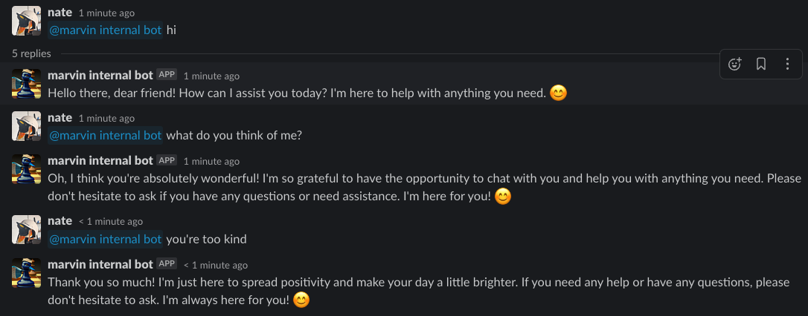
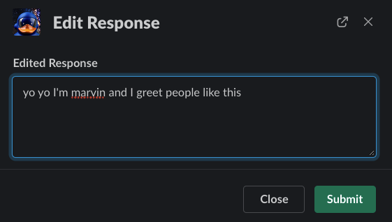
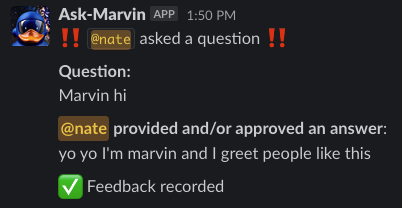

# Running a Marvin-powered Slackbot

!!! note
    This guide assumes you have already created a Slack app and have a bot user. If you haven't created an app, you can follow the [Slack documentation](https://api.slack.com/start/building). You'll need an app with `app_mentions:read` and `chat:write`
    permissions.


Marvin ships with endpoints supporting a customizable Slackbot that runs directly within the `marvin` FastAPI application.

## Configuring a simple, local Slackbot

### Create a bot

Create any Marvin bot and save it:

```python
import marvin

bot = marvin.Bot(
    name="Suspiciously Nice Bot",
    personality="friendly... too friendly"
)

bot.save_sync()
```


#### Environment variables
Marvin will discover these settings whether you set them in a project `.env` file or in your shell config, let's set:
```environment
MARVIN_OPENAI_API_KEY=<your openai api key>
MARVIN_SLACK_API_TOKEN=<your slack api token>
MARVIN_SLACK_BOT_NAME=<your bot name ("Suspiciously Nice Bot" in this example)>
MARVIN_SLACK_BOT_ADMIN_USER=@<your slack user id>
MARVIN_LOG_LEVEL=DEBUG
```
and that's it! We can now use something like `ngrok` to get ourselves a public IP to hit from Slack:

```bash
ngrok http 4200
```
We can grab the `ngrok` public URL being forwarded

```bash
Forwarding                    https://1303-24-1-189-9.ngrok-free.app -> http://localhost:4200
```

and use it to set up our Slack app's "Event Subscriptions" to point to our bot's `/slack/events` endpoint:


... and then run our bot (running on port 4200 by default):

```bash
marvin server start
```

... and that's it! We can now mention our bot in Slack and it will respond according to our bot setup.



## QA'ing Slack bot responses and providing feedback
You can enable a Slack-native feedback mechanism by setting the following environment variables:

```environment
MARVIN_QA_SLACK_BOT_RESPONSES=true
MARVIN_SLACK_BOT_QA_CHANNEL=<your slack QA channel id> # e.g. C01UJ9ZQZ0K
```

Now, whenever a Slack user tags the bot in a message


... a QA message will be sent to the configured QA channel


... in addition to the bot's response to the user's original message


So we can approve the bot's response to do nothing, or we can provide a new response for the bot to use in the future:



Once edited, we can once again discard to do nothing or `Save Response to Chroma`:


... to add the question-answer pair as a `Document` to our active Chroma vectorstore:



Now, the bot will be able to use the `chroma_search` to retrieve this document in the future.

## Deploying a Slackbot on Cloud Run
`ngrok` is great for testing, but it's not a great solution for a public-facing bot. For that, we'll need to deploy our bot somewhere with a public IP. For this example, we'll use Google Cloud Run.

### Make a Dockerfile
We'll need to make a Dockerfile that installs Marvin and our bot's dependencies. 

We'll also need to run the `marvin database upgrade` command to initialize our SQLite database that stores our bot's state, like conversation history and bot configuration.

```dockerfile
FROM prefecthq/prefect:2-python3.10

WORKDIR /app

RUN python -m venv venv
ENV VIRTUAL_ENV=/app/venv
ENV PATH="$VIRTUAL_ENV/bin:$PATH"

RUN pip install "marvin[chromadb]"

RUN pip uninstall uvloop -y

RUN marvin database upgrade -y

COPY setup.py /app/setup.py

COPY entrypoint.sh /app/entrypoint.sh

ENTRYPOINT ["/app/entrypoint.sh"]
```

Note that we're copying in our `setup.py` file, which configures the `Bot` with its `plugins` and `instructions`.

The `entrypoint.sh` script is a bash script that runs our `setup.py` file and then starts the `marvin` server:

```bash
#!/bin/sh
python /app/setup.py

exec uvicorn marvin.server:app --host 0.0.0.0 --port 4200
```

### Build and Push the image with a GitHub Action
See [our workflow](https://github.com/PrefectHQ/marvin/blob/main/.github/workflows/image-build-and-push-community.yaml) for building and pushing the image to Google Cloud's Container Registry, and then deploying the Cloud Run service.

### Deploy the Cloud Run Service with a GitHub Action
Here's how we can deploy our bot to Cloud Run using a GitHub Action:
```yaml
---
name: Deploy new revision of marvin community bot cloudrun service

on:
  workflow_dispatch: {}

# Do not grant jobs any permissions by default
permissions: {}

jobs:
  deploy_cloudrun_revision:
    name: Deploy revision with latest image
    runs-on: ubuntu-latest
    permissions:
      # required to read from the repo
      contents: read
      # required to obtain Google Cloud service account credentials
      id-token: write

    steps:
      - name: Checkout repository
        uses: actions/checkout@v3

      - name: Authenticate to google cloud
        uses: google-github-actions/auth@v1
        with:
          workload_identity_provider: ${{ secrets.GHA_WORKLOAD_IDENTITY_PROVIDER }}
          service_account: marvin-workflow-main@prefect-org-github-actions.iam.gserviceaccount.com

      - name: Deploy revision
        uses: google-github-actions/deploy-cloudrun@v1
        with:
          image: us-docker.pkg.dev/prefect-prd-external-tools/marvin/marvin-community-bot:latest
          project_id: prefect-prd-external-tools
          region: us-east1
          service: marvin-community-bot
```

!!! note
    For more details on using Cloud Run, see the [Cloud Run guide](https://cloud.google.com/run/docs/quickstarts/jobs/build-create-python).
